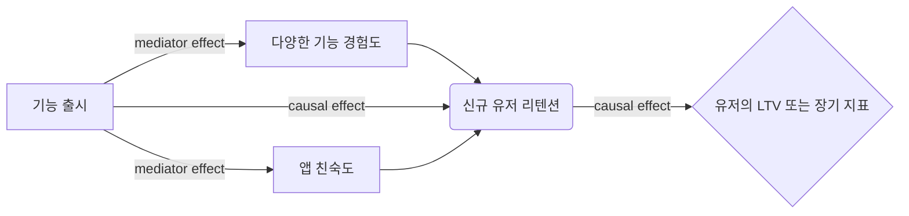

# Uber's Mediation Modeling: 우버의 매개효과 모델링

우버 랩스에서는 행동 과학 기반의 인사이트와 방법론을 사용하여 프로덕트와 마케팅 팀에서 유저 경험을 향상시키는 미션을 가지고 있습니다. 최근에는 학술적 연구에서 통계적인 방법론인 [mediation modeling](http://davidakenny.net/cm/mediate.htm) 을 도입하여 유저들의 불편함을 개선하고자 합니다.

Mediation modeling은 단순 인과 관계를 넘어, 어떤 메커니즘이 내재하여 결과로 이끌었는지를 이해하는 데에 효과적입니다. 이 모델을 통해 프로덕트를 섬세하게 튜닝할 수 있고, 우버 플랫폼에서 성공적인 기능에 내재하는 메커니즘을 기반으로 새로운 프로덕트를 개발할 수 있습니다.

> 원문: Mediation Modeling at Uber: Understanding Why Product Changes Work (and Don’t Work)원문 작성자: Bonnie Li, Totte Harinen

## Whether를 아는 것 vs Why를 이해하는 것

우버에서는 잦은 실험을 통해 한 변수가 다른 변수에 영향을 미치는지 아닌지를 검증하는 문화가 강합니다. 더 안정적이고, 신뢰 가능하고, 결함이 없는 유저 경험을 위해서입니다.

대부분의 경우 왜 두 변수가 연관 되었는지에 대해 가설을 둡니다.

> 목적: 신규 라이더의 리텐션 상승
액션: 신규 라이더에게 최초 몇 회의 라이드에서 가격 할인을 제공하는 프로모션

이 경우, 보통의 분석 방법은 이 액션이 목적을 달성했는지 아닌지의 여부를 가르쳐주지만 왜인지는 알 수 없습니다.

예를 들어서,

> 신규 라이더가 가격 할인 때문에 앱에 돌아온 것인가?
프로모션이 신규 라이더가 앱에 익숙해지는데에 도움을 준 것인가?
아니면 완전히 다른 원인인가?
만약 위에 명시한 여러 원인들이 다 내재했다면, 어떤 것이 더 크게 작용했고 얼마나 중요한 것인가?

특정 두 변수가 관계가 있다는 증거가 있더라도, 왜 관계가 있는지에 대한 원인을 명확히 이해하기는 어렵습니다. 이렇게 원인에 대해 이해하지 못했을 때, 시도와 실패에 의존할 수 밖에 없습니다. 하지만, 학술적인 연구에서는 주로 Whether이 아닌 Why를 중요시합니다. 우버에서도 유저들을 위해 더 나은 프로덕트를 개발하고자 하는데요. 위에서 든 예시의 경우, 만약 `프로모션이 신규 라이더에게 앱에 익숙해지는 데에 도움을 줬다` 는 사실을 발견한다면 앞으로의 프로덕트 변화는 라이더들이 앱을 사용하게 만드는 것을 우선순위로 둬야 합니다.

## Mediation modeling

Mediation modeling은 조치와 결과 변수 사이의 블랙 박스를 열어, 내재하는 메커니즘을 드러냅니다. 학술적 연구에서는 자주 쓰이지만, 비즈니스에서는 잘 활용되고 있지 않습니다.

인과 가정이 있을 때, 그대로 두거나 상관적 증거에 의존하는 것 보다는, mediation modeling은 두 변수간의 인과 관계 경로들을 실험적으로 테스트(vs 논리적 추론)하게 합니다. 이러한 인과 관계 경로 즉, 메커니즘을 이해하는 것은 변화의 어떤 요소가 프로덕트를 성공시키는 것에 책임이 있는지 짚어낼 수 있게 하므로 프로덕트를 더 빠르고 효율적으로 개발하도록 도울 수 있습니다.

그래서, 정확히 mediation modeling으로 유저 경험을 개선하기 위해 무엇을 할 수 있나요? 아래 이미지와 함께 몇 가지 상황을 설명합니다.

첫째로, **프로덕트의 가정을 검증하기 위해 사용할 수 있습니다.**  위에 얘기했던 예시와 동일한데요.

> 목적: 신규 라이더의 리텐션 상승
액션: 신규 라이더에게 최초 몇 회의 라이드에서 가격 할인을 제공하는 프로모션
가설: 신규 라이더 프로모션을 통해서 가격 할인을 제공하면 신규 라이더 리텐션을 상승 시킬 수 있을 것이다.

이 경우, mediation modeling과 함께 가설을 실증적으로 테스트할 수 있습니다. 테스트 결과가 이 가정이 맞는지 아닌지의 여부를 알려주고, 만약 맞다면 다른 원인 (ex. `앱 친숙도` ) 에 비해서 `가격 할인` 이라는 요소가 얼만큼의 효과를 줬는지까지 알려줍니다.

두번째로, **다수의 원인 메커니즘을 비교할 때 사용 가능합니다.**

> 주요 원인1: 우버 이츠의 신규 메뉴 디자인
매개 원인2: 조회한 레스토랑 수
매개 원인3: 조회한 메뉴 수
매개 원인4: 의사 결정 소요 시간
등등..
결과: 우버 이츠 주문량

이 경우, mediation modeling을 통해 조치의 결과(`우버 이츠 주문량 증가분`)에서 각각 메커니즘이 얼마나 기여했고 가장 크게 기여한 메커니즘은 무엇인지 추정할 수 있습니다. 이러한 결과가 앞으로 프로덕트를 디자인하는 방식과 미래의 iteration을 개선하는 데에 도움을 줍니다.

세번째로, **정량화하기 어려운 무형의 변수들을 비즈니스 메트릭과 연결할 수 있게 합니다. (ex. 소비자의 감정)** 알다시피, 소비자의 감정이나 만족은 비즈니스의 성공에 중요한 요소입니다. 하지만 비즈니스 임팩트를 정량화하기가 어렵죠. Mediation modeling은 이 어려운 문제를 각 변수들이 다운스트림 비즈니스 메트릭에 어떻게 영향을 주는지 테스트할 수 있게 합니다. (ex. 라이더 레퍼럴)

네번째로, **장기의 목표를 작은 중간 목표들로 쪼개는 창의적인 방식입니다.** 예를 들어, 목표가 우버 라이더의 장기적인 만족도를 상승시키는 것이라고 했을 때, 이 목표를 어떻게 더 쪼개어 하루 하루 일 하는 데에 연결지을 수 있을까요? 만일 라이더의 장기적인 만족도의 주요한 매개 변수를 찾는담녀, 이 매개 변수를 단기 KPI로 설정할 수 있습니다. 만약 대부분의 처치 효과가 특정 요인(메커니즘) 하나로만 매개된다면, 이 특정 요인에 영향을 주는 것이 처치가 실제로 작동하기 위한 필요 조건일 수 있습니다. (충분은 아닙니다)

이런 여러가지 사용 가능한 상황에서, upstream과 downstream 변수를 찾고 각 변수들이 서로 어떻게 연결되었는지 테스트합니다.  다음으로는 개념적인 요소에 대해서 설명합니다.

## 우버의 적용 예시

우버에서 최근에 Customer Obsession team과 함께 적용한 mediation modeling 케이스입니다.

> 목적: 드라이버 서포트 티켓 수 감소 (customer support tickets)
액션: 드라이버의 일별 수입 현황을 보여주는 그래프를 추가
가설: 드라이버의 일별 수입 현황을 보여주는 그래프를 추가하면 드라이버가 서포트 티켓을 신청하는 수가 감소할 것이다.

드라이버 유저들이 더 적은 서포트 티켓을 신청하도록 하기 위해서, 애초에 티켓을 신청하는 이유를 알고 싶었습니다.

이전의 실험에서 Customer Obsession 팀은 드라이버의 일별 수입 현황을 보여주는 조치가 그들의 수입에 대한 이해를 유의미하게 높였다는 걸 확인했습니다. 아래가 실험군과 대조군의 UI입니다.

이 분석에서, 수입에 대한 이해도는 single-item survey를 통해서 드라이버들이 얼마나 본인의 수입 정보를 이해했는지 5단계의 스케일로 측정되었습니다.

알고자 했던 것은, 이러한 수입에 대한 이해도가 수입과 연계된 서포트 티켓의 근본적인 원인 메커니즘인지입니다. 다른 말로는 일별 수입 현황 그래프를 추가하는 조치가 수입에 대한 이해도를 증가시켰는지 아닌지를 보고자 했다고도 할 수 있습니다. 그리고 만약 이 케이스가 맞다면, 다른 원인 요소들에 비교했을 때 이 일별 수입 현황 그래프 추가하는 조치가 얼마만큼의 효과를 매개시켰는지도 추정하고자 했습니다.

이러한 질문들에 답하기 위해 mediation modeling을 사용했는데요.

> 독립 변수: 수입 현황 그래프 여부
매개 변수: 수입 이해도
종속 변수: 수입과 연계된 서포트 티켓의 수
추가한 것: 드라이버의 실험 이전 서포트 티켓 수, 실험 이전 수입, 실험 이전의 라이드 수, 실험 이전의 active days

또한 마지막에 sensitivity analysis를 통해 mediation modeling의 결과가 unmeasured mediator-outcome 교란 변수들에 있어서의 robustness를 측정하였습니다.

Mediation modeling은 드라이버들의 수입에 대한 이해도가 수입 연계 서포트 티켓 생성의 유의미한 메커니즘임을 입증했습니다. 전체 처치 효과에서의 19%를 차지했습니다. 이 결과 기반으로, 수입에 대한 이해도가 유저의 수입 연계 서포트 티켓을 줄이기 위한 중요한 방향이라는 것을 배웠습니다.

이 인사이트를 통해서, 드라이버의 수입에 대한 이해도를 올리기 위해 더 나은 프로덕트와 커뮤니케이션을 디자인할 수 있습니다. 동시에, 전체 처치 효과에서의 81%를 차지하는 메커니즘이 무엇인지 더 연구해보는 기회가 남았습니다. 이 기회를 성취하기 위해, Customer Obsession 팀과 함께 더 많은 행동 메커니즘을 테스트해보려고 합니다. 이러한 테스트 결과는 드라이버 수입 프로덕트 로드맵에 정보를 제공할 예정입니다.

## Mediation modeling의 미래

You can delete the current file by clicking the **Remove** button in the file explorer. The file will be moved into the **Trash** folder and automatically deleted after 7 days of inactivity.

## 생각 보태기

프로덕트 데이터 분석가로 일하면서 계속해서 고민하는 문제, "목표 KPI에 어느 정도의 효과가 있었을까요?"

특히 실험을 진행할 때의 목표 KPI는 iteration cycle의 속도를 올리기 위해 단기 지표로 세팅되는 경우가 많은데요. 이 경우 전사적으로 바라보는 장기 지표 또는 거시적인 관점과 alignment가 떨어지기도 합니다.

매스프레소의 프로덕트 로드맵에 함께하면서, 두 가지 근본적인 고민이 떠올랐습니다.

- A/B 테스팅을 넘어, 또는 A/B 테스팅을 할 수 없는 상황들이 존재하는데 이 경우 어떻게 product assumption을 검증할까?
- 실험의 KPI (단기지표)를 상승시키면 전사 KPI (장기지표) 도 증가할까? 즉, 우리의 실험 cycle이 궁극적으로 올바른 방향으로 굴러가고 있는 것인지. 어떻게 검증할까?

요즘은 이 두 고민을 해결하기 위해 다양한 방법론을 찾고 있습니다. 그 과정에서 우버의 블로그 글이 딱 원하는 포인트를 짚어냈고, 실무에서 적용해보고 싶습니다. :smile:

